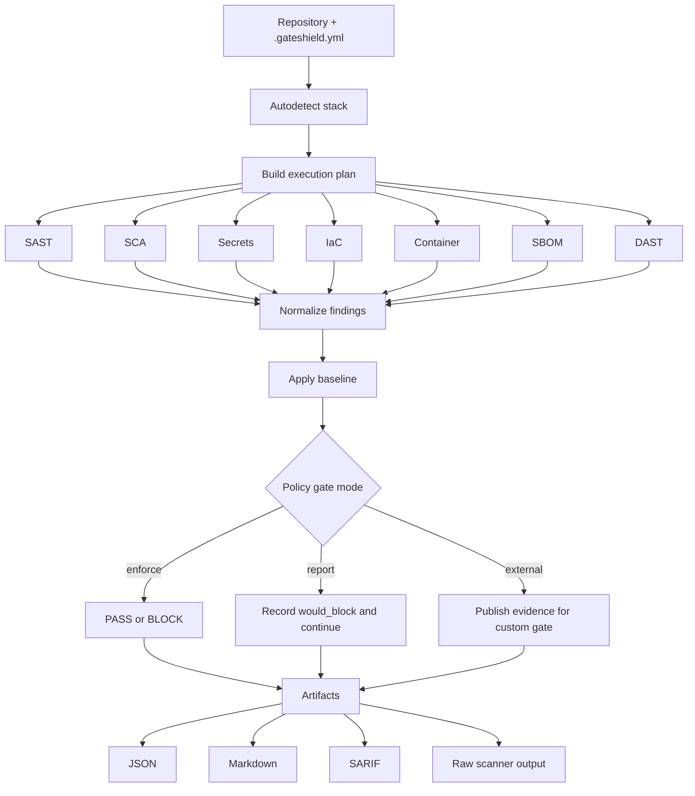

# GateShield

[](https://www.python.org/)
[](https://pypi.org/project/gateshield/)
[](https://github.com/matgasp/gateshield/actions/workflows/ci.yml)
[](https://github.com/matgasp/gateshield/blob/main/LICENSE)


**Policy-driven security orchestration for hardened CI/CD pipelines.**

GateShield centralizes security checks that would otherwise be duplicated across repositories. A project declares **what** should run; GateShield autodetects the stack, selects the appropriate scanners, normalizes findings, applies baseline-aware policy gates, and produces reusable JSON, Markdown, SARIF, and raw artifacts.

GateShield is an **orchestrator**, not a replacement for the scanners it runs. Detection stays with tools such as Semgrep, Bandit, Trivy, Gitleaks, Checkov, Syft, pip-audit, and OWASP ZAP.

> **Current release:** `0.0.1` — public alpha.

## Why GateShield

Security pipelines often become repetitive and inconsistent: every repository carries its own scanner installation logic, severity rules, artifact handling, and exceptions. GateShield moves those concerns into one reusable security layer.

A consumer repository can stay focused on intent:

```yaml
scan:
  sast: true
  sca: true
  secrets: true
  iac: auto
  container: auto
  sbom: true
  dast: false
```

GateShield decides what should run based on the detected stack and the configured policy.

## How it works



## Core capabilities

- **Stack autodetection** for Python, Java, Go, C/C++, JavaScript/TypeScript, .NET, Terraform, Docker, Helm, and Kubernetes.
- **Tri-state scan selection** with `true`, `false`, and `auto`.
- **Reusable scanner orchestration** without copying scanner-specific commands into every repository.
- **Local execution with Docker fallback** for supported scanners.
- **Scope-aware pull-request scans** and full scans for main/manual execution.
- **Baseline-aware findings** classified as `NEW`, `EXISTING`, or `RESOLVED`.
- **Three gate modes:** `enforce`, `report`, and `external`.
- **Raw + normalized artifacts**, configurable by category.
- **Stable machine-readable report contract** for custom corporate gates.
- **Consolidated SARIF** for GitHub Code Scanning.
- **Custom artifacts** for organization-specific scanners and reports.
- **DAST safety controls**, including target allowlists and fork-PR protection.
- **Stable exit codes** for CI/CD automation.
- **Version-pinned toolchain** for reproducible scanner execution.

## Security checks

| Category | Default tools | Purpose |
| --- | --- | --- |
| SAST | Semgrep; Bandit for Python | Source-code security analysis |
| SCA | Trivy filesystem; pip-audit for Python requirements | Dependency vulnerability analysis |
| Secrets | Gitleaks | Detect credentials and sensitive material committed to source |
| IaC | Checkov + Trivy config | Terraform, Kubernetes, Helm, and configuration analysis |
| Container | Trivy config; optional Trivy image | Dockerfile/config and container-image checks |
| SBOM | Syft | CycloneDX software bill of materials |
| DAST | OWASP ZAP | Runtime web application scanning |

Scanner selection can be adjusted through `scanners.<category>.include` and `exclude`.

## Installation

### PyPI

After the package is published:

```bash
pipx install gateshield
```

or:

```bash
python -m pip install gateshield
```

### Directly from GitHub

```bash
pipx install git+https://github.com/matgasp/gateshield.git
```

### Development install

```bash
git clone https://github.com/matgasp/gateshield.git
cd gateshield
python -m pip install -e ".[dev]"
```

### Docker

```bash
docker build -t gateshield:local .
docker run --rm -v "$PWD:/repo" -w /repo gateshield:local scan .
```

## Quick start

Create a configuration:

```bash
gateshield init .
```

Preview what GateShield would run:

```bash
gateshield plan .
```

Inspect scanner availability:

```bash
gateshield tools check
```

Run a scan:

```bash
gateshield scan .
```

GateShield uses `.gateshield.yml` by default. See [`.gateshield.example.yml`](https://github.com/matgasp/gateshield/blob/main/.gateshield.example.yml) for the complete configuration surface.

## Minimal configuration

```yaml
scan:
  sast: true
  sca: true
  secrets: true
  iac: auto
  container: auto
  sbom: true
  dast: false

gate:
  mode: enforce
  new_findings_only: true
```

Every scan selector accepts:

- `true` — force the category to run;
- `false` — disable the category;
- `auto` — run only when GateShield detects a relevant stack/target.

## Execution model

With `execution.mode: auto`, GateShield uses this order:

```text
local scanner binary
        |
        | unavailable
        v
Docker fallback
        |
        | unavailable
        v
missing-tool operational error
```

Example:

```yaml
execution:
  mode: auto
  timeout_seconds: 600
  require_tools: true
```

When `require_tools: true`, a requested scanner that cannot run is an operational failure. A scanner crash is never interpreted as a clean security scan.

## Gate modes

### `enforce`

```yaml
gate:
  mode: enforce
```

Findings matching a blocking policy can stop the CI flow with exit code `1`.

### `report`

```yaml
gate:
  mode: report
```

GateShield calculates `would_block`, writes all reports/artifacts, and returns success for security findings. Operational failures still fail the job.

### `external`

```yaml
gate:
  mode: external
```

Use this when your organization has its own policy engine or approval logic. GateShield becomes the evidence producer and leaves the final security decision to a downstream step/job.

A report can contain:

```json
{
  "gate": {
    "mode": "external",
    "would_block": true,
    "enforced_block": false
  }
}
```

## Severity and category policies

```yaml
gate:
  mode: enforce
  new_findings_only: true

  severity:
    critical: block
    high: block
    medium: warn
    low: report
    info: report

  categories:
    secrets:
      any: block
```

This allows a category such as secrets scanning to block independently of a scanner's severity label.

## Baseline adoption

Legacy repositories often contain pre-existing findings that should not prevent initial adoption.

After a completed scan:

```bash
gateshield baseline create .gateshield/out/report.json
```

Future scans classify findings as:

- `NEW` — not present in the baseline;
- `EXISTING` — already acknowledged in the baseline;
- `RESOLVED` — previously present and no longer detected.

Fingerprints use scanner, rule, relative path, and normalized finding context. Absolute line numbers are intentionally excluded so a harmless line shift does not recreate the finding.

## Artifacts

GateShield produces a normalized artifact per enabled category and can preserve raw scanner output.

```yaml
artifacts:
  enabled: true
  retention_days: 14

  categories:
    sast:
      enabled: true
      name: company-sast
      path: build/security/sast
      raw: true

    secrets:
      enabled: true
      raw: false
      retention_days: 3
```

Raw secrets-scanner output is **disabled by default**. Normalized secret findings redact detected secret material.

### Custom artifacts

```yaml
artifacts:
  custom:
    - name: internal-dast
      path: reports/internal-dast.json
      category: dast
      format: raw

    - name: company-normalized-sast
      path: reports/company-findings.json
      category: sast
      format: gateshield
```

`format: gateshield` allows normalized external findings to participate in the GateShield report/gate contract. Raw custom artifacts are preserved as evidence but are not interpreted automatically.

The CLI supports any number of custom artifacts. The current composite GitHub Action uploads the first five custom artifact entries individually.

## Reports

The default output directory is:

```text
.gateshield/out/
├── report.json
├── report.md
└── gateshield.sarif
```

The stable normalized report contract is documented by:

[`schemas/gateshield-report-v1.json`](https://github.com/matgasp/gateshield/blob/main/schemas/gateshield-report-v1.json)

GateShield also preserves category-specific normalized and optional raw artifacts under `.gateshield/artifacts/` unless you override their paths.

## GitHub Action

After the `v0.0.1` tag exists:

```yaml
name: Security

on:
  pull_request:
  push:
    branches: [main]

permissions:
  contents: read

jobs:
  gateshield:
    runs-on: ubuntu-latest
    steps:
      - uses: actions/checkout@v4
        with:
          fetch-depth: 0
          persist-credentials: false

      - uses: matgasp/gateshield@v0.0.1
        with:
          config_path: .gateshield.yml
```

The action defers the final gate exit until configured artifacts have been uploaded, so a blocking finding does not make the evidence disappear.

## Reusable GitHub workflow

```yaml
jobs:
  security:
    uses: matgasp/gateshield/.github/workflows/gateshield.yml@v0.0.1
    with:
      config_path: .gateshield.yml
      upload_sarif: true
```

The reusable workflow keeps the scan job at `contents: read`. `security-events: write` is isolated to the optional SARIF upload job.

## Pull-request scope

The default scope mode is:

```yaml
scope:
  mode: auto
  base_ref: origin/main
```

`auto` means:

- pull request → incremental/scope-aware checks where supported;
- main/manual/local execution → full scan.

Secrets scanning and explicitly configured DAST remain independently controlled because their security relevance does not always map cleanly to changed-file suffixes.

## DAST

DAST is disabled by default because GateShield must never assume it is authorized to scan an arbitrary target.

```yaml
scan:
  dast: true

dast:
  target: http://localhost:8080
  mode: baseline
  allowed_hosts:
    - localhost
    - 127.0.0.1
```

Optional headers can reference environment variables rather than embedding credentials:

```yaml
dast:
  headers:
    Authorization: "${GATESHIELD_DAST_AUTH}"
```

GateShield does not manage the application's lifecycle. Start the target before invoking DAST and stop it in your own pipeline. DAST is skipped by default for fork pull requests.

Only scan systems you own or are explicitly authorized to test.

## CodeQL

GateShield `0.0.1` intentionally does not wrap CodeQL. Use GitHub's native CodeQL workflow and, when useful, register its SARIF output as a custom artifact.

This keeps language-specific build behavior and GitHub-native CodeQL configuration visible instead of hiding it behind an incomplete abstraction.

## Toolchain

Default scanner versions are pinned in `.gateshield.yml` / GateShield defaults. Inspect the effective toolchain with:

```bash
gateshield tools list
gateshield tools check
```

The initial `0.0.1` defaults include:

| Tool | Version |
| --- | ---: |
| Semgrep | 1.175.0 |
| Bandit | 1.9.4 |
| pip-audit | 2.10.1 |
| Gitleaks | 8.29.1 |
| Trivy | 0.74.0 |
| Checkov | 3.3.19 |
| Syft | 1.52.0 |
| OWASP ZAP | 2.17.0 |

Toolchain versions can be overridden explicitly when required.

## Exit codes

| Code | Meaning |
| ---: | --- |
| `0` | Success / findings not enforced |
| `1` | Security gate blocked |
| `2` | Configuration or target error |
| `3` | Required scanner unavailable |
| `4` | Scanner execution/parsing failure |
| `5` | Invalid or corrupted report |

In `external` and `report` modes, security findings do not return `1`; operational failures continue to return their respective non-zero codes.

## Public-repository security model

GateShield is designed to be usable from public repositories, but repository code and pull requests must be treated as untrusted input.

Recommended defaults:

- use GitHub-hosted runners for untrusted public pull requests;
- do not attach a persistent privileged self-hosted runner to a public repository;
- keep `GITHUB_TOKEN` permissions minimal;
- keep checkout credentials disabled where unnecessary;
- never expose DAST credentials to fork pull requests;
- keep raw secret artifacts disabled unless you have a controlled reason to retain them;
- review custom scanners before allowing them to execute on untrusted code.

See [`SECURITY.md`](https://github.com/matgasp/gateshield/blob/main/SECURITY.md) for vulnerability reporting and repository-security guidance.

## Intentionally vulnerable fixtures

The `fixtures/` directory contains intentionally insecure examples used by automated tests and manual validation:

- `python-vulnerable/`
- `terraform-vulnerable/`
- `container-webapp/`

They contain **demonstration vulnerabilities, not real credentials**, and must not be treated as production templates.

## Development

```bash
python -m pip install -e ".[dev]"
pytest -q
```

The public CI matrix targets Python 3.12, 3.13, and 3.14.

Build distribution artifacts with:

```bash
python -m build
python -m twine check dist/*
```

## PyPI publishing

The repository includes a Trusted Publishing workflow for PyPI. Configure a PyPI Trusted Publisher for:

- owner: `matgasp`
- repository: `gateshield`
- workflow: `publish.yml`
- environment: `pypi`

Then publish a GitHub Release/tag such as `v0.0.1`. No long-lived PyPI API token needs to be stored in GitHub Secrets.

## Scope

GateShield intentionally focuses on CI/CD security checks and evidence generation. It does **not** contain:

- AI/LLM analysis;
- SIEM/log aggregation;
- Kafka/event streaming;
- a central database/server;
- observability infrastructure;
- a GRC platform.

Those are outside the responsibility of this project.

## Keywords

`appsec`, `devsecops`, `ci-cd`, `security-automation`, `security-gates`, `sast`, `sca`, `dast`, `secret-scanning`, `iac-security`, `container-security`, `sbom`, `software-supply-chain`, `github-actions`, `semgrep`, `gitleaks`, `trivy`, `checkov`, `owasp-zap`, `policy-as-code`

## Naming note

GateShield is an independent open-source project and is not affiliated with other products, companies, or organizations that may use the GateShield name.

## License

GateShield is released under the [MIT License](https://github.com/matgasp/gateshield/blob/main/LICENSE).

## Security

If you discover a vulnerability in GateShield itself, do not publish sensitive exploit details or credentials in a public issue. Follow the process in [`SECURITY.md`](https://github.com/matgasp/gateshield/blob/main/SECURITY.md).
